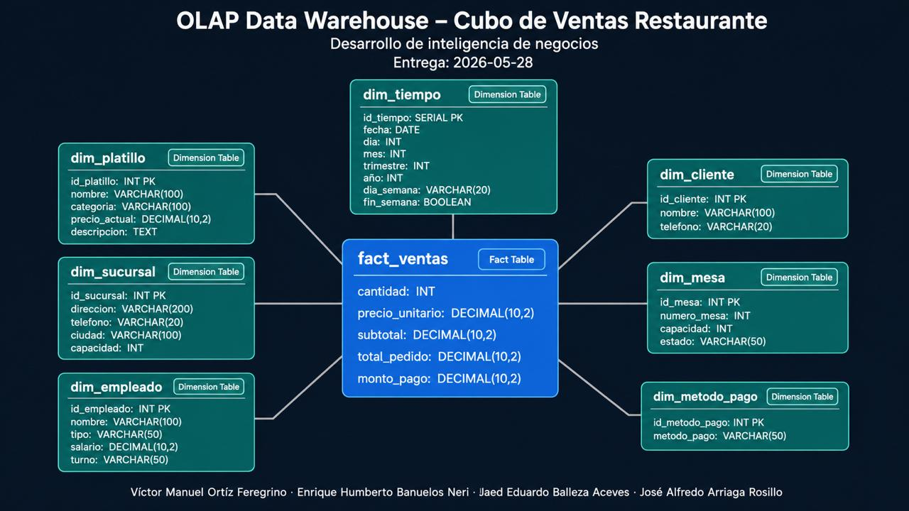

# OLAP Data Warehouse – Cubo de Ventas Restaurante

## Descripción General

Este proyecto implementa un modelo OLAP (Online Analytical Processing) para el análisis de ventas de un sistema de restaurantes utilizando PostgreSQL y Docker. El objetivo principal del cubo es optimizar consultas analíticas y servir como base para herramientas de Business Intelligence (BI) y procesos de Machine Learning.

El modelo fue diseñado a partir de una base de datos OLTP previamente desarrollada por otro equipo del proyecto.

---

# Arquitectura General

```text
OLTP PostgreSQL
        ↓
      ETL
        ↓
OLAP Data Warehouse
        ↓
BI / Machine Learning
```

---

# Diagrama Estrella



---

# Tecnologías Utilizadas

| Tecnología | Descripción                          |
| ---------- | ------------------------------------ |
| PostgreSQL | Motor de base de datos               |
| Docker     | Contenerización del entorno          |
| SQL        | Construcción del warehouse           |
| Parquet    | Exportación de datos analíticos      |
| Python     | Exportación y procesamiento de datos |

---

# Objetivo del Cubo

El cubo de ventas permite analizar:

* Ventas por sucursal
* Ventas por periodo de tiempo
* Platillos más vendidos
* Métodos de pago más utilizados
* Rendimiento de empleados
* Consumo por cliente
* Tendencias históricas

---

# Granularidad

La granularidad definida para el cubo es:

> Cada fila de la tabla `fact_ventas` representa un platillo vendido dentro de un pedido.

Esto permite realizar análisis detallados por producto, cliente, sucursal y periodo de tiempo.

---

# Modelo Dimensional

El warehouse utiliza un modelo dimensional tipo estrella (Star Schema).

## Fact Table

### `fact_ventas`

Tabla central encargada de almacenar métricas numéricas relacionadas con las ventas.

### Métricas principales

* cantidad INT
* precio_unitario DECIMAL 10,2
* subtotal DECIMAL 10,2
* total_pedido DECIMAL 10,2
* monto_pago DECIMAL 10,2

---

# Dimensiones

## `dim_tiempo`

Permite realizar análisis temporales.

### Campos principales

* id_tiempo SERIAL PRIMARY KEY
* fecha DATE
* dia INT
* mes INT
* trimestre INT
* año INT
* dia_semana VARCHAR(20)
* fin_semana BOOLEAN

---

## `dim_cliente`

Información descriptiva de clientes.

### Campos principales

* id_cliente INT PRIMARY KEY
* nombre VARCHAR(100)
* telefono VARCHAR(20)

---

## `dim_platillo`

Información descriptiva de platillos.

### Campos principales

* nombre VARCHAR(100)
* categoria VARCHAR(100)
* precio_actual DECIMAL(10,2)
* descripcion TEXT

---

## `dim_sucursal`

Información de sucursales del restaurante.

### Campos principales

* id_sucursal INT PRIMARY KEY
* direccion VARCHAR(200)
* telefono VARCHAR(20)
* ciudad VARCHAR(100)
* capacidad INT

---

## `dim_empleado`

Información relacionada con empleados.

### Campos principales

* id_empleado INT PRIMARY KEY,
* nombre VARCHAR(100)
* tipo VARCHAR(50)
* salario DECIMAL(10,2)
* turno VARCHAR(50)

---

## `dim_mesa`

Información de mesas utilizadas en pedidos.

### Campos principales

* id_mesa INT PRIMARY KEY
* numero_mesa INT
* capacidad INT
* estado VARCHAR(50)

---

## `dim_metodo_pago`

Información relacionada con métodos de pago.

### Campos principales

* id_metodo_pago INT PRIMARY KEY,
* metodo_pago VARCHAR(50)

---

# Estructura del Proyecto

```text
OLAP-RestaurantDB/
│
├── 01_schema.sql
├── 02_dimensiones.sql - revisión
├── 03_fact_ventas.sql
├── 04_indices.sql 
├── 05_consultas_olap.sql - revisión
└── README.md
```

---

# Descripción de Archivos

## `01_schema.sql`

Contiene:

* creación del schema OLAP
* creación de dimensiones
* creación de fact tables
* relaciones y llaves foráneas

---

## `04_indices.sql`

Contiene índices para optimización analítica.

Ejemplo:

```sql
CREATE INDEX idx_fact_tiempo
ON olap.fact_ventas(id_tiempo);
```

---

## `05_consultas_olap.sql`

Contiene consultas analíticas para validación y explotación del cubo.

---

# Entorno de Desarrollo

El sistema se ejecuta mediante Docker utilizando PostgreSQL como motor principal.

## Ejecución del contenedor

```bash
docker exec -it restaurante_db psql -U postgres -d restaurante
```

---

# Esquema OLAP

El warehouse utiliza un schema separado dentro de PostgreSQL:

```sql
CREATE SCHEMA olap;
```

Esto permite mantener separación entre:

* sistema transaccional (OLTP)
* sistema analítico (OLAP)

---

# Índices

Se utilizan índices para optimizar consultas analíticas frecuentes.

Ejemplos:

* id_tiempo
* id_cliente
* id_platillo
* id_sucursal

---

# Consultas Analíticas Ejemplo

## Ventas por mes

```sql
SELECT t.nombre_mes,
       SUM(f.subtotal)
FROM olap.fact_ventas f
JOIN olap.dim_tiempo t
ON f.id_tiempo = t.id_tiempo
GROUP BY t.nombre_mes;
```

---

## Platillos más vendidos

```sql
SELECT p.nombre,
       SUM(f.cantidad)
FROM olap.fact_ventas f
JOIN olap.dim_platillo p
ON f.id_platillo = p.id_platillo
GROUP BY p.nombre
ORDER BY SUM(f.cantidad) DESC;
```
<!--
---

# Integración con ETL

El equipo ETL será responsable de:

* extracción de datos OLTP
* transformación de datos
* carga de dimensiones
* carga de fact tables
* exportación parquet
-->
---

# Integración con Machine Learning

Los datos del warehouse podrán exportarse a formato Parquet para su utilización en procesos de análisis y Machine Learning.

---
